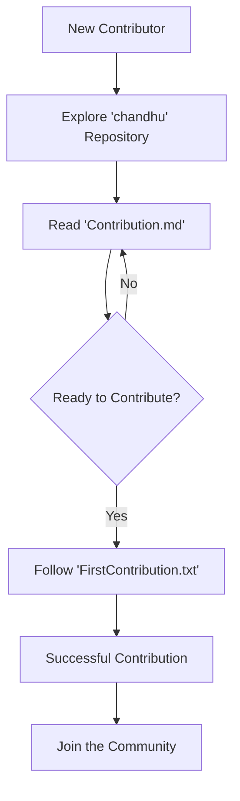

# 🚀 chandhu

## Short Description
Welcome to `chandhu` – your ultimate launchpad into the world of open-source contributions! This project serves as a clear, concise, and empowering guide, specifically crafted to demystify the contribution process for both seasoned developers and absolute beginners. It provides all the essential information you need to make your first impactful contribution with confidence and ease.

## ✨ Key Features
*   **Comprehensive Contribution Guide (`Contribution.md`):** A meticulously detailed document outlining the general guidelines, best practices, and expectations for contributing to this or any similar open-source project.
*   **First-Time Contributor Walkthrough (`FirstContribution.txt`):** A hands-on, step-by-step tutorial designed to shepherd new contributors through their very first successful pull request, ensuring a smooth and rewarding initial experience.
*   **Accessible & Clear Documentation:** All guides are written in plain, easy-to-understand language, focusing on clarity to reduce friction for newcomers.
*   **Empowers Newcomers:** Built with the philosophy that everyone can contribute, providing the tools and knowledge to turn aspirations into actual contributions.

## Who is this for?
*   **Aspiring Open Source Contributors:** Anyone eager to make their mark in open source but unsure where to start.
*   **First-Time Git/GitHub Users:** Individuals looking for a practical guide to understand Git workflows and GitHub mechanics.
*   **Project Maintainers:** A potential template or inspiration for creating clear contribution guidelines for your own projects.
*   **Students & Learners:** An excellent resource for educational purposes, teaching the fundamentals of collaborative development.

## Technology Stack & Architecture
This project leverages the universal power of **Markdown** and **Plain Text** for its documentation. The architecture is elegantly simple, focusing on highly accessible and readable content that functions as a self-contained knowledge base. It's designed to be effortlessly consumed, requiring no specialized software beyond a text editor or a web browser.

## 📊 Architecture & Database Schema
While not a traditional software system, the `chandhu` project offers a streamlined informational architecture to guide the contribution flow.



## ⚡ Quick Start Guide
Getting started with `chandhu` is straightforward and designed for immediate engagement.

1.  **Clone the Repository:**
    ```bash
    git clone https://github.com/chandana629/chandhu.git
    cd chandhu
    ```
2.  **Begin Your Journey:**
    *   Open and meticulously read `Contribution.md` to understand the overarching philosophy and rules for contributing.
    *   Next, dive into `FirstContribution.txt` and follow the practical steps provided to make your very first contribution to an open-source project!

Start contributing today and become a part of the global open-source community!